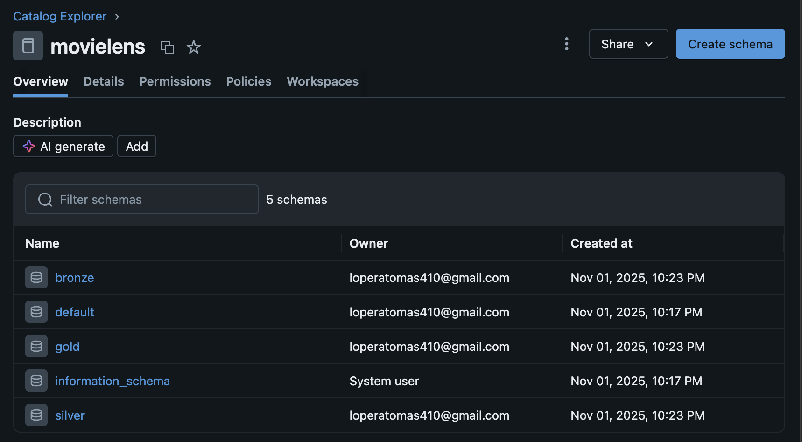
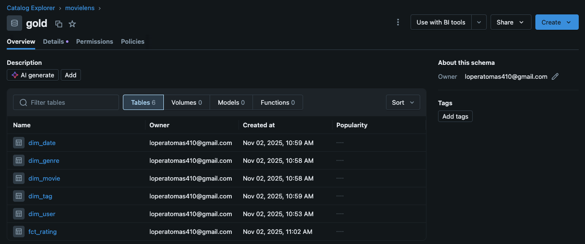

# MovieLens Lakehouse on Databricks

Este proyecto implementa un **Lakehouse** en **Databricks** utilizando el dataset [MovieLens](https://www.kaggle.com/datasets/grouplens/movielens-20m-dataset).

El objetivo es construir un flujo aplicando la arquitectura **Medallion (Bronze → Silver → Gold)** y aprovechar **Spark + Delta Lake** para el procesamiento, limpieza y modelado analítico.

## Arquitectura
```bash
├── bronze/ → Datos crudos ingeridos desde archivos CSV
├── silver/ → Datos limpios y estandarizados
└── gold/ → Modelo analítico tipo estrella (Dimensional)
```



### Capa Bronze
- Ingesta de archivos CSV locales
- Tablas:
  - `movie`
  - `rating`
  - `tag`
  - `link`
  - `genome_tags`
  - `genome_scores`


### Capa Silver
- Limpieza, tipificación y normalización.
- Uso de PySpark (`functions`, `regexp_extract`, `split`, `explode`).
- Se crean tablas intermedias:
  - `movies`
  - `movie_genres`
  - `ratings` y `ratings_latest`
  - `tags`
  - `links`, `genome_tags`, `genome_scores`


### Capa Gold
Modelo analítico tipo **estrella (Star Schema)** con una sola fact table (`fct_rating`) y las dimensiones relacionadas.

#### Tablas:
| Tabla | Tipo | Descripción |
|--------|------|-------------|
| `dim_user` | Dimensión | Usuarios que califican |
| `dim_movie` | Dimensión | Películas con su género principal |
| `dim_genre` | Dimensión | Catálogo único de géneros |
| `dim_date` | Dimensión | Calendario (año, mes, día, semana) |
| `dim_tag` | Dimensión | Catálogo de tags de usuarios |
| `fct_rating` | Hechos | Calificaciones (FK a usuario, película, fecha y tag) |


